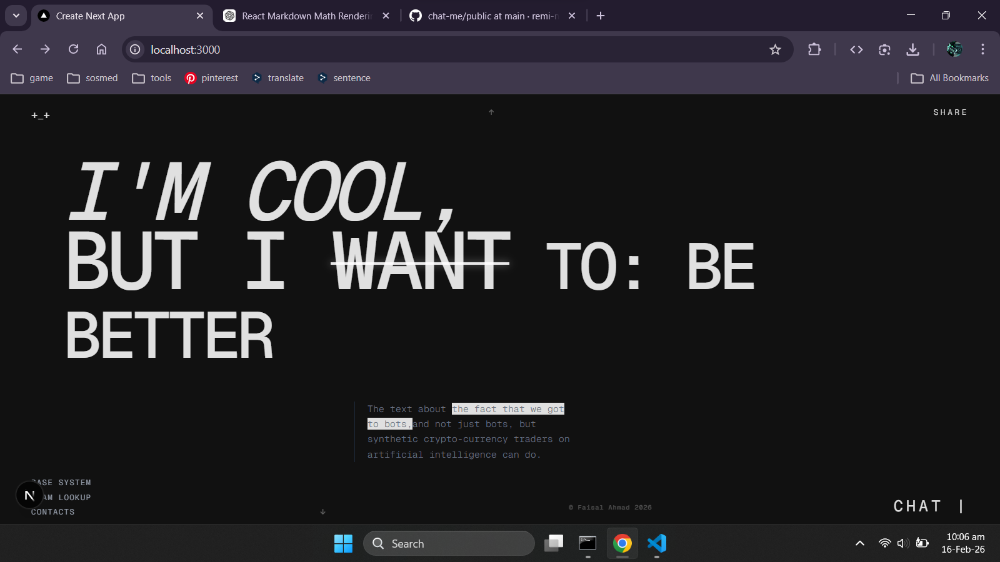
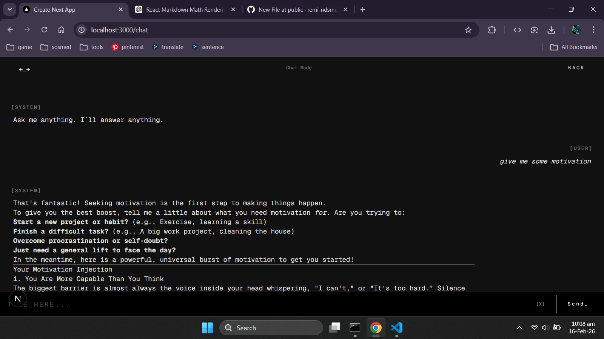

# 🚀 Chat Web App

> Modern real-time chat web application built with Next.js.

---

## 🇮🇩 Deskripsi (Bahasa Indonesia)

Chat Web App adalah aplikasi web chat modern yang dibangun menggunakan Next.js dengan arsitektur App Router.  
Dirancang dengan tampilan yang clean, responsif, dan performa yang cepat.

Aplikasi ini cocok sebagai project portfolio frontend/fullstack modern.

---

## 🇺🇸 Description (English)

Chat Web App is a modern web-based chat application built using Next.js with the App Router architecture.  
Designed with a clean UI, responsive layout, and optimized performance.

This project is suitable as a modern frontend/fullstack portfolio project.

---

## ✨ Features

- ⚡ Built with Next.js (App Router)
- 🎨 Modern & Clean UI
- 📱 Fully Responsive
- 🚀 Fast Performance
- 🌐 Production Ready
- 🔒 Environment Variable Support

---

## 🛠 Tech Stack

- Next.js
- React
- JavaScript
- Tailwind CSS
- Node.js

---

## 📸 Screenshots

> Simpan screenshot di folder: `public/screenshots/`

### 🏠 Home Page



### 💬 Chat Page



---

## 📦 Installation

### 1️⃣ Clone Repository

```bash
git clone https://github.com/remi-ndsme/chat-me.git
2️⃣ Go to Project Folder
cd chat-me
3️⃣ Install Dependencies
npm install
🚀 Run Development Server
npm run dev
Open in browser:

http://localhost:3000
🏗 Build for Production
npm run build
npm start
📂 Project Structure
chat-me/
├── app/
├── components/
├── public/
│   └── screenshots/
├── styles/
├── package.json
└── README.md
🌍 Deployment
You can deploy this project easily to:

Vercel

Netlify

VPS / Custom Hosting

📈 Future Improvements
Real-time WebSocket integration

Authentication (JWT / OAuth)

Database integration

Chat room support

Dark mode

👨‍💻 Author
Remi Ndsme
GitHub: https://github.com/remi-ndsme

📄 License
This project is licensed under the MIT License.
